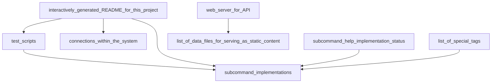

# NgramDB Project


# Active Data Pipelines in the System

Updating markdown graph of connections.



```bash
$ ngram --help
Usage: ngram  [subcommand] [--help | options... ]
Subcommands:
checksums
cleanup
clear-logs
create
dependstats
find-executable
findrefsto
forcelink
hastag
id
jsonset
link
list
logs
query
refdata
refs
replace
run
run-single
set-title
start
stubname
tag
tagfiles
tsort
tui
tui-video
venv
```

## subcommand: create

- parse args with case statement
- pass in --clone to clone a template

```bash
$ ngram create --help
Usage: ngram create  [ options ] directory
Options:
    -t|--title) # set title in README of created data point
    -c|--clone) # clone from a template data point ID, bringing over all its files
    -e|--venv) # start shell in a new virtual environment
    -j|--json) # provide input JSON data
    -v|--verbose)
    -h|--help)
```
## subcommand: query

- perform graph queries with graph links, tags, and JSON data within Ngram.
- this is a reverse polish notation machine that performs queries across a graph by using operators from set theory and refrences between IDs.
- starting with all IDs, apply successive operations until desired nodes are reached or the working set becomes empty.

```bash
$ ngram query --help
RPN graph query language implementation for Ngram
Usage: ngram query  [ options ] directory
Options:
    -h|--help) # print help text
operators
    refs - get refs from the current working set
    refstype - get refs from the current working set that match a certain string - used for types of links
    looserefs - get loose refs (not required to be executable) from the current working set
    refsto - get all refs to the current working set
    id - use a single ID as the new working set, 1 parameter
    not - set difference - remove things occuring in the following tag, file, or subcommand argument
    union - union working set with another
    filterjson - filter workingset by json parameters using jq select syntax
    json - return all data.json files in the working set appended together as a JSON array
    jsonset - set a json field value, 2 required parameters after
    expand - expand all references into functional group
    dirs - utility operator to return the entire current working set as directory paths
```
### Example Queries

Queries are possible using a simple query engine that supports traversing graphs.

```bash
# look for things tagged test
ngram query @test
# pretty print output with titles of README.md files as the names of data points
ngram query --human @test
# look for things referenced by things tagged logdata and web
ngram query @logdata @web refs
# repeat that query but look for only references tagged csvfile
ngram query @logdata @web refs @csvfile
# look for pets owned by my family members that are not tagged as cats?
ngram query @me refs @person @family refs @pet not @cat
# subqueries are possible using bash redirection - inverse of previous query, but looking for pets not owned by my family members that are not tagged as cats
ngram query @pet not <( ./ngram query @me refs @person @family refs @pet not @cat )
```

## subcommand: tui

- Terminal User Interface prompt with workflow shortcuts for working with Ngram
- uses fzf for graphics

```bash
$ ngram tui --help
Usage: ngram tui  [ options ] directory
Options:
    -v|--verbose)
    -h|--help)
```
## subcommand: run

- entrypoint to run one single cycle of ngram.
- one cycle is defined as one pass over all IDs with programs that have dependencies that have changed since the last time the program was run.
- returns a status code of 1 if nothing was run
- run all IDs in topological order

## subcommand: start

- start running the command as a service
- supports backing off to a maximum refresh interval if there are no changes

## subcommand: logs

- retrieve all run logs for an Ngram ID

## subcommand: id

- internal
- generate a unique ID
- optionally use a custom timestamp
- Some formatting options:
- %b for abbreviated Month name: Jul
- %B for full Month name: July
- %a for abbreviated weekday name: Tue
- %A for full weekday name: Tuesday
- %d for day of month: 20
- %Y for 4 character year: 1999

```bash
$ ngram id --help
Usage: ngram id  [ options ] directory
Options:
    -d|--date) # provide a custom date to use as a timestamp within the ID
    -f|--date-format) # date format if providing a custom date
    -v|--verbose)
    -h|--help)
```
## subcommand: list

- list Ngram data points in database
- alias: ngram ls

## subcommand: jsonset

- set json fields

```bash
$ ngram jsonset --help
Usage: ngram jsonset id field value [-n : numeric]
```
## subcommand: cleanup

- clean up empty directories
- this is primarily for dealing with git leaving empty directories laying around when reverting changes

## subcommand: checksums

- here is the logic to determine what files get scanned for changes
- gz files cannot be included in checksums because the data does not seem to be deterministic across machines and versions

## subcommand: dependstats

- find checksums of all dependencies for an ID
- used to create .hashes files for comparison

## subcommand: findrefsto

- find things that reference this ID

## subcommand: forcelink

- force a link from ID in arg 1 to arg 2.
- do this by adding IDs to a data file that is marked executable

## subcommand: hastag

- check if an Ngram ID has a tag

```bash
$ ngram hastag --help
usage ngram hastag tagquery 20240704164832-ae846f0d186e581bb7aa
```
## subcommand: link

- create a loose link from one ngram directory to another.
- do this by adding a valid markdown link to the directory to the README file.
- usage: ngram link fromid toid [ reason ]
- provide a reason as an optional third parameter.

## subcommand: refdata

- print a table of all references

## subcommand: refs

- find refs by ID
- pass --all as parameter to get table of all refs
- pass --type "type" parameter to filter only references containing a certain string on the same line - used for types of relationships

## subcommand: replace

- utility subcommand to replace a file.
- use this when possible instead of shell redirection to avoid overwriting files until the program is complete.
- example: echo ... | ngram replace datafile.dat

## subcommand: set-title

- set the title of an Ngram data point
- overwrites the first title in the README.md markdown file and the title field in the data.json file.
- replace title in existing readme file

```bash
$ ngram set-title --help
Usage: ngram set-title  [ options ] directory
Options:
    -t|--title) # set or replace title in markdown file
    -v|--verbose)
    -h|--help)
```
## subcommand: stubname

- generate stub names for IDs based on titles

## subcommand: tag

- get or alter the tags of a data set

```bash
$ ngram tag --help
Usage: ngram tag [ options ] directory
Options:
    -l|--list) # list tags for ID
    -t|--tag) # add tag
    -d|--delete) # remove a tag (passed as argument after)
    -v|--verbose)
    -h|--help)
```
## subcommand: tagfiles

- internal
- list all tag files present

## subcommand: tsort

- internal
- do a topological sort of the input IDs based on their dependencies between them
- usage: ngram tsort id1 id2 id3 ...
- usage as standard input pipe: ... | ngram tsort

## subcommand: venv

- launch a virtual environment where all shell variables are defined to support the ngram CLI
- optional ID parameter or --latest to specify an ID for a working directory


## Datapoint Program Conventions
By convention, a datapoint program should produce consistent standard output results. If the standard output changes, it will trigger frequent downstream reruns.
By convention, once coding for a datapoint is complete, the format of the files generated should remain consistent to avoid breaking downstream things.

- [list of conventions that make it work](/database/20240712155448-c6051910fe8a0deddcc6)

## Programs
Programs can generate one or more output files, in addition to the default behavior of logging to standard output and stderr log files within their own directory during every run.
The most recent standard output from a run of a program is stored in a file `stdout.log` which is also data that can be reused within the system.
- [Interactively generating this readme for the project](/database/20240709053001-b005119b744456da6cc0)
- [information about batch runner implementation](/database/20240712160752-273f1cf3f63a0b6cb514)

# Ngram CLI help

## how to run
```bash
# run once and continue until the system is in a stable state with no file changes propogating
ngram run
# run continuously in a loop and start services + web API
ngram start
# start interactive text user interface for development
ngram tui
```

- [Improvements on the horizon](/database/20240712005430-5afb3d6fbd05ebc95616)

## CLI help

- [Subcommand Implementations](/database/20240704164832-ae846f0d186e581bb7aa/README.md)
Automatically generated help documentation:


# Test Run Output

```
running tests
ALL TESTS PASSED!
SUCCESS test changetitle
SUCCESS test customdate-id
SUCCESS test dependencies-match-refs
SUCCESS test graphquery-cats
SUCCESS test reftest
SUCCESS test settags
SUCCESS test sorted-vs-tsorted
SUCCESS test test-graph-refs
SUCCESS test testclone
SUCCESS test testcreate
SUCCESS test testquery
SUCCESS test topographical-sort-test
SUCCESS test unique-ids
```

# Information
ngramdb
Nicholas Long
2024
MIT License

Copyright (c) 2024 nicholas-long

Permission is hereby granted, free of charge, to any person obtaining a copy
of this software and associated documentation files (the "Software"), to deal
in the Software without restriction, including without limitation the rights
to use, copy, modify, merge, publish, distribute, sublicense, and/or sell
copies of the Software, and to permit persons to whom the Software is
furnished to do so, subject to the following conditions:

The above copyright notice and this permission notice shall be included in all
copies or substantial portions of the Software.

THE SOFTWARE IS PROVIDED "AS IS", WITHOUT WARRANTY OF ANY KIND, EXPRESS OR
IMPLIED, INCLUDING BUT NOT LIMITED TO THE WARRANTIES OF MERCHANTABILITY,
FITNESS FOR A PARTICULAR PURPOSE AND NONINFRINGEMENT. IN NO EVENT SHALL THE
AUTHORS OR COPYRIGHT HOLDERS BE LIABLE FOR ANY CLAIM, DAMAGES OR OTHER
LIABILITY, WHETHER IN AN ACTION OF CONTRACT, TORT OR OTHERWISE, ARISING FROM,
OUT OF OR IN CONNECTION WITH THE SOFTWARE OR THE USE OR OTHER DEALINGS IN THE
SOFTWARE.
