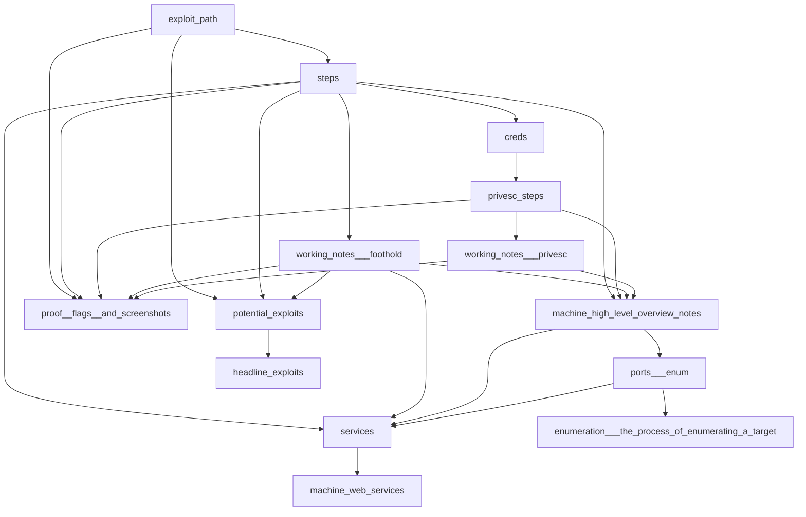

# connections within the system

- [graph](graph.md)
- install graphviz
```bash
brew install graphviz
```

- found reference to interesting note
  - 20221030041924 generate mermaid graph from set of zet cards


- working on developing script
```bash
ngram refs --all
ngram --help

ngram stubname
20240704164832-ae846f0d186e581bb7aa subcommand_implementations
20240705000124-9769d8256b20e049b259 test_scripts
20240709053001-b005119b744456da6cc0 interactively_generated_README_for_this_project
20240709100932-2e4a4e28d39fd497a43b subcommand_help_implementation_status
20240710030405-6e67d04f1dd286a4efce testing_virtual_environments
20240710031116-0ca3a02fbed884dca76b updating_tag_file_names
20240710034914-b60f3d16bfedb0bad97f getting_rid_of_checksums_in_git
20240710043728-86ad27b18da4fa187615 connections_within_the_system

ngram refdata
20240705000124-9769d8256b20e049b259 20240704164832-ae846f0d186e581bb7aa
20240709053001-b005119b744456da6cc0 20240704164832-ae846f0d186e581bb7aa
20240709053001-b005119b744456da6cc0 20240705000124-9769d8256b20e049b259
20240709100932-2e4a4e28d39fd497a43b 20240704164832-ae846f0d186e581bb7aa

gawk '
BEGIN { print "graph TD;" }
ARGIND == 1 { name[$1] = $2 }
ARGIND > 1 { print "  " name[$1] " --> " name[$2] ";" }
' <( ngram stubname ) <( ngram refdata )
```
