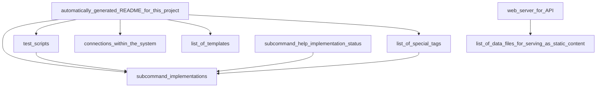

```mermaid
graph TD;
  test_scripts --> subcommand_implementations;
  automatically_generated_README_for_this_project --> subcommand_implementations;
  automatically_generated_README_for_this_project --> test_scripts;
  automatically_generated_README_for_this_project --> connections_within_the_system;
  automatically_generated_README_for_this_project --> list_of_templates;
  automatically_generated_README_for_this_project --> list_of_special_tags;
  subcommand_help_implementation_status --> subcommand_implementations;
  web_server_for_API --> list_of_data_files_for_serving_as_static_content;
  list_of_special_tags --> subcommand_implementations;
```
